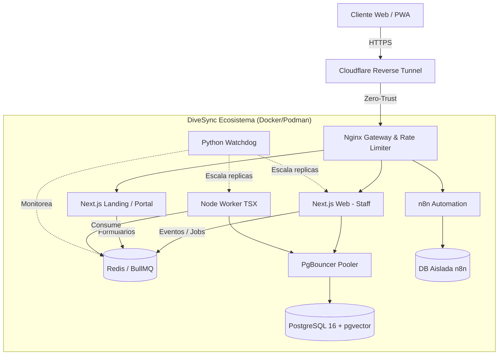

# 🚀 DiveSync: SaaS Orchestration & Ecosistema Integral

DiveSync no es simplemente un MVP de gestión; es una plataforma SaaS de misión crítica concebida para digitalizar, centralizar y gobernar la operativa completa de un centro de buceo (reservas, instructores, certificaciones, flujo de caja y compliance legal). Fue diseñado bajo tres dogmas arquitectónicos inquebrantables: **máxima resiliencia, costos operativos reducidos (Target OPEX $0) y seguridad perimetral Zero-Trust**. A continuación, se detalla la documentación técnica L2 (implementaciones y comandos) y L3 (decisiones de arquitectura y riesgos) del ecosistema.

## 🏗 Arquitectura y Topología (L3)

Diseñé este proyecto descartando intencionalmente las arquitecturas tradicionales monolíticas (MVC) y la programación orientada a objetos (POO) con estado mutable. Opté por un enfoque puramente funcional, fuertemente tipado y asíncrono, separando la ingesta web de la computación pesada en background, promoviendo el aislamiento estricto en cada capa.

### Diagrama de Topología Lógica



### Decisiones de Diseño y Paradigmas
- **Rechazo del Patrón MVC Clásico:** El uso de MVC acopla fuertemente el estado y la lógica de negocio, dificultando la integración fluida con los agentes de IA (viola el Principio de Menor Privilegio) y destruyendo las ventajas de rendimiento de los *React Server Components*.
- **Paradigma Funcional y *Zero Client State*:** Implementé un modelo donde el estado transaccional reside en el servidor o en la URL (Search Params). Erradiqué gestores globales pesados en el cliente. Para mutaciones, uso *Higher-Order Functions* (HOFs) envolviendo *Server Actions* inmutables de Next.js 16. Esto mitiga vulnerabilidades de inyección y Cross-Site Scripting (XSS), ya que los payloads financieros no se hidratan innecesariamente en el navegador.
- **Micro-Frontends Híbridos en Monorepo:** Utilizando `pnpm workspaces` y Turborepo (`turbo.json`), segmenté lógicamente `apps/web` (Panel administrativo), `apps/customer-portal` (B2C compliance/PWA) y `packages/database` (Core ORM compartido).
- **Target OPEX $0:** Todo el despliegue se consolidó on-premise sobre una VPS KVM2 (Hostinger), sin depender de costosos planos de control como Kubernetes. La alta disponibilidad se gestiona internamente mediante contenedores efímeros y *Smart Rebuilds*.

## ⚙️ Orquestación Central e Infraestructura (L2 / L3)

### El Orquestador de Precisión: `rebuild.sh` (L3)
La compilación monorepo puede agotar rápidamente la memoria de una VPS al reconstruir todo ante el menor cambio. Para solucionarlo, construí `.agents/workflows/rebuild.sh`, un orquestador Bash que implementa un sistema de **"Smart Rebuild"**. Este script actúa como el cerebro del despliegue, aplicando hashing criptográfico para evaluar qué módulos exactos mutaron antes de instruir al daemon de Docker.

*Extracto Core: Detección criptográfica de mutaciones en código (L2)*
```bash
function check_change() {
  local path=$1
  if [ ! -e "$path" ]; then return 0; fi
  # Hashea el árbol ignorando .dotfiles y node_modules para evitar falsos positivos
  local current_hash=$(find "$path" -maxdepth 10 -type f -not -path '*/.*' -not -path '*/node_modules/*' -exec md5sum {} + 2>/dev/null | sort | md5sum | cut -d' ' -f1)
  CURRENT_HASHES["$path"]="$current_hash"
  local hash_file="$STATE_DIR/${path//\//_}.hash"
  
  if [ -f "$hash_file" ]; then
    if [ "$current_hash" == "$(cat "$hash_file")" ]; then return 1; fi # Sin cambios
  fi
  return 0 # Mutado
}

# Inferencia de dependencia: Si muta la BD, se reconstruye el backend completo
CHANGES_DB=false; if check_change "packages/database/prisma/schema.prisma"; then CHANGES_DB=true; fi
```

El orquestador también gestiona de forma atómica las migraciones (ejecutando contenedores worker efímeros con `docker compose run --rm ... prisma db push`) y mantiene el host limpio mediante rutinas de `deep_cleanup`, purgando imágenes *dangling* seguras.

### Autoscaler Predictivo en Python para High Availability (L3)
En ausencia de Kubernetes Horizontal Pod Autoscaler (HPA), desarrollé un watchdog determinístico en Python (`infra/autoscaler/main.py`) que interactúa de forma programática con el socket local de Podman/Docker.

*Extracto Core: Lógica Predictiva y Resiliencia (L2)*
```python
def monitor_and_scale():
    while True:
        # 1. Monitoreo predictivo de carga Frontal (CPU Web)
        current_web = get_service_replicas('web')
        avg_cpu = get_cpu_usage('web')
        
        if avg_cpu > CPU_THRESHOLD_UP and current_web < MAX_WEB_REPLICAS:
            os.system(f"docker compose up -d --scale web={current_web + 1}")
            
        # 2. Backpressure Monitoring: Monitoreo de encolamiento (Worker/BullMQ)
        current_worker = get_service_replicas('worker')
        q_depth = r.llen("bull:orderkill-automation-incoming:waiting")
        
        if q_depth > QUEUE_THRESHOLD_UP and current_worker < MAX_WORKER_REPLICAS:
            os.system(f"docker compose up -d --scale worker={current_worker + 1}")
            
        time.sleep(POLL_INTERVAL)
```
Este diseño resuelve asimétricamente dos vectores de asfixia: Picos de peticiones HTTP en el frontend, y saturación de tareas cognitivas asíncronas (Inferencia IA, reportes PDF) encoladas en BullMQ. Incorpora tolerancia a *Podman Rootless* donde los cgroups de CPU pueden no reportar un delta de sistema exacto.

## 🛡️ DevSecOps, Seguridad Perimetral y Shift-Left (L2 / L3)

### Dualismo Estratégico de Red (L3)
Diseñé un entorno polarizado para priorizar tanto la agilidad (*Vibe Coder friendly*) como la máxima paranoia corporativa:
- **Red Aplanada (Dev):** Bridge local simple donde los puertos quedan expuestos al `localhost` para iteración y depuración ultrarrápida.
- **Red Segmentada (Prod):** Topología *Default Deny* gobernada por UFW. Todo el ecosistema Docker queda encapsulado sin directivas `ports`. El ingreso es exclusivo mediante el túnel Cloudflare Zero Trust que enruta hacia el **Gateway Nginx**. Nginx provee el Rate Limiting con amortiguación de ráfagas (`burst/delay`) y bloqueo de vulnerabilidades (*H2C Smuggling*). Además, el daemon de *CrowdSec* ingiere los `access.log` en milisegundos y banea dinámicamente direcciones IP en IPTables ante detección de anomalías.

### SDLC Seguro y Shifting Left (L2)
La seguridad se inyecta desde la terminal del desarrollador. Adoptamos *Trunk-Based Development* gestionado de forma integral en GitHub Projects (SSOT Kanban).
Todo *Pull Request* hacia `main` enfrenta el **Integrity Guard** y el **Security Pipeline**, ejecutado en GitHub Actions:
- **SAST (Semgrep):** Con reglas customizadas para evitar inyecciones e instanciación insegura del cliente Prisma. Las exclusiones (ej. `# nosemgrep`) están sumamente restringidas y prohibidas de modificar por la IA sin autorización explícita.
- **Supply Chain Security y Gestión Cuantitativa de Riesgos (FAIR & Trivy):** La imagen Docker se escanea en tiempo de compilación mediante Trivy. Si se detectan vulnerabilidades **CRÍTICAS** o **ALTAS** en las dependencias base (ej. librerías subyacentes del SO o de Node), el *pipeline* falla de inmediato abortando la generación de artefactos. Este control preventivo mitiga el riesgo de vulnerabilidades heredadas e impacta directamente en nuestro análisis cuantitativo (**FAIR**), reduciendo drásticamente la **Frecuencia de Eventos de Pérdida (LEF)** asociada a la explotación de componentes de terceros. Además, Gitleaks intercepta tokens quemados previniendo fugas en los commits.

## 🗄️ Motor de Datos y Aislamiento Multi-Tenant (L2 / L3)

### Row-Level Security (RLS) Mandatorio (L3)
Dado el esquema SaaS B2B, prevenir la filtración lateral de datos (Data Bleed) entre inquilinos (Tenants) era la directiva de máxima urgencia. En lugar de confiar ciegamente en clausuras `where: { tenantId }` a nivel aplicación —fácilmente vulnerables por despistes o alucinación agéntica— delegué la seguridad al motor transaccional de PostgreSQL.

*Extracto Core: Tenant-Aware Prisma Extension (L2)*
```typescript
// Implementación L2 de Cliente Prisma Inyectado con RLS
export const prismaTenantAware = (tenantId: string) => {
  return prisma.$extends({
    query: {
      $allModels: {
        async $allOperations({ args, query }) {
          // Aislamiento por defecto: Se impone un contexto transaccional en Prisma
          return prisma.$transaction(async (tx) => {
            // El Tenant_ID se graba en la variable de configuración local de la sesión de Postgres
            await tx.$executeRaw`SELECT set_config('app.current_tenant_id', ${tenantId}, TRUE)`;
            
            // PostgreSQL evaluará sus políticas RLS automáticamente garantizando la criptografía del límite lógico
            return await query(args);
          });
        },
      },
    },
  });
};
```
Esta barrera inquebrantable garantiza que si un endpoint mal diseñado intenta extraer facturas, PostgreSQL arrojará o denegará silenciosamente los registros ajenos al `app.current_tenant_id` de la sesión activa.

## 🤖 Gobernanza Agéntica y Estandarización (L3)

DiveSync implementa una estructura simbiótica avanzada (Humano + Agentes IA) regida por una constitución inmutable:
- **L1/Global_Manifest.md & Rules Maestras:** Operan como el sistema operativo del agente. Todo agente de ingeniería DEBE asimilar esto en su *Boot Sequence* (Ciclo de Onboarding) antes de generar cualquier bloque de código.
- **Protocolo de Interrupción Prioritaria (PIP):** Una directiva de máxima urgencia. Si un humano dicta *"Hard Stop - ejecuta el issue #XX"*, la IA pausa automáticamente su hilo lógico, orquesta un backup o `git stash` en memoria (guardando `.agent-context.md`), y pivota el contexto para resolver la emergencia, retornando al final.
- **Matriz de Autonomía (Agent Decides):** Los agentes aplican un *Risk Score* (Bajo/Medio/Alto). Tienen total libertad para lectura/inspección. Tienen permiso consultado para refactorizaciones menores. Pero para operaciones estructurales (Infraestructura, Mutaciones DDL en DB, Reglas de Autenticación), **enfrentan un Hard Stop sistémico**, demandando revisión e interacción humana confirmada (HITL) para prevenir corrupciones asíncronas no documentadas.
- **Sincronización Buffer-Disco:** Como guardrail ineludible, se prohíbe que el agente ejecute linters, validaciones (ej: `pnpm test`) o compilaciones si el humano no ha persistido los archivos en disco.

## ⚛️ Stack Tecnológico y Lógica de Negocio Granular (L2)

El desarrollo del núcleo operativo está segmentado bajo Next.js 16.2.7 (App Router) en TypeScript y empaquetado bajo un monolito con `pnpm` workspaces (`apps/web`, `apps/landing`, `apps/customer-portal`, `packages/database`).
- **UI/UX Premium:** Tailwind CSS v4 con variables globales HSL, *Dark Mode Orchestrator* (next-themes), componentes base derivados de Shadcn. Filosofía estética "Aesthetics that WOW" (Glassmorphism minimalista). Validaciones robustas en frontera mediante esquemas de **Zod** y formularios integrados con *React Hook Form*.
- **Gestión IAM (AuthN/AuthZ):** Auth.js v5 (beta) como núcleo de Identidad, inyectando el `tenant_id` y `role` (`ADMIN`, `OPERATOR`, `INSTRUCTOR`, etc.) directamente en el payload del token JWT, lo cual es interpretado por el Edge Middleware para bloquear accesos anónimos velozmente en el borde.

### Módulos Core Transaccionales (B2B & B2C)
1. **Catálogo e Inventario:** Control rígido de equipos de buceo en stock (reguladores, BCDs) y servicios ofertados.
2. **Turnos y Reservas:** Panel de "Daily Operations" con timeline predictivo asincrónico. Algoritmos matemáticos prohíben la sobreventa cruzando la capacidad de la embarcación con el ratio Alumnos/Instructor.
3. **Instructores y Liquidaciones:** Motor que audita inmersiones realizadas, cruza identificadores con *Pay Rates* parametrizados y exporta la balanza contable de honorarios a liquidar (Double-entry accounting proxy).
4. **Caja y Finanzas:** Arqueo diario, inmutabilidad de los flujos de ingresos (checkout counter) contra los egresos por consumo de logística (combustible de embarcación).
5. **Compliance Digital (Formularios RSTC/DAN):** Generación efímera de JWT Tokens, enviados vía Resend, permitiendo al cliente acceder al `Customer Portal` (PWA). Ahí completan el cuestionario médico y el "Release Waiver" firmando digitalmente sobre un `<canvas>` HTML5 que se guarda y blinda en Base64 en el ecosistema del SaaS.

## 🧠 Integración IA (CoWorker) y Vectores (L2 / L3)

Para la capa cognitiva de valor añadido, instrumenté el **DiveSync CoWorker**, un agente B2B al servicio del Tenant operando bajo el framework LangChain (v1.3.3+).

- **Procesamiento Asíncrono Estricto:** La inferencia en modelos generativos tiene alta latencia. Si permitimos la ejecución síncrona en Next.js Server Actions, saturaríamos el pool de Node.js. En DiveSync, el cliente ejecuta un POST rápido; la API encola un Job en BullMQ (sobre Redis) y retorna velozmente un `202 Accepted`. Un worker de backend en `apps/web/src/workers/automation-worker.ts` consume la tarea de forma aislada e interactúa con Anthropic/OpenAI, aplicando un control de **Backpressure** para tolerar HTTP 429 sin efecto dominó.
- **Búsqueda Vectorial HNSW Local:** Descarté incurrir en OPEX con proveedores de DDBB Vectoriales (como Pinecone). Configuré la extensión nativa `pgvector` directamente en PostgreSQL. Para garantizar escalabilidad y baja latencia cognitiva (sub-milisegundo) se utilizan índices probabilísticos de grafos (*HNSW*).
- **Aislamiento Multi-Tenant RAG (L3):** En la fase RAG (Retrieval-Augmented Generation), es crucial evitar que un CoWorker alucine o extraiga datos privados de otros institutos de buceo. Todas las búsquedas vectoriales emplean la métrica de *distancia Coseno* integradas transparentemente en transacciones seguras bajo RLS. El motor de Postgres garantizará criptográficamente que la recuperación del `DocumentChunk` esté delimitada al vector-space único del inquilino, aniquilando el vector de ataque más crítico del SaaS asistido por IA.
