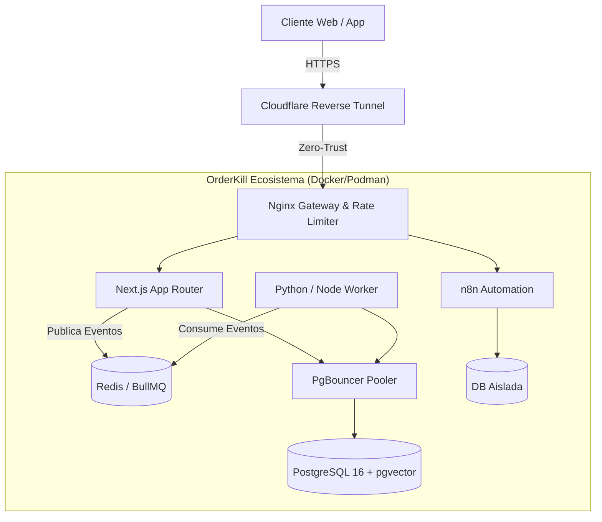

# 🚀 OrderKill: SaaS Orchestration & Ecosistema Resiliente

OrderKill no es solo un MVP; es un ecosistema SaaS de misión crítica construido bajo premisas innegociables: **máxima resiliencia, costos operativos reducidos (Target OPEX $0) y seguridad integral (Zero-Trust)**. A continuación, presento la documentación de nivel L2 (pasos exactos, implementaciones) y L3 (arquitectura, riesgos y alternativas) de las decisiones de ingeniería que lideré para este proyecto.

## 🏗 Arquitectura y Topología (L3)

Diseñé este proyecto repeliendo arquitecturas monolíticas y frameworks fuertemente acoplados. Opté por un enfoque puramente funcional y *Event-Driven* para garantizar el escalamiento independiente de los nodos de procesamiento pesado, separando estrictamente la ingesta web de la computación asíncrona.

### Diagrama de Topología Lógica



### Decisiones de Diseño y Alternativas
- **¿Por qué no Kubernetes?** El objetivo empresarial exigía OPEX $0 o mínimo. K8s requiere un plano de control pesado y costoso (EKS/GKE). Opté por **Docker Compose / Podman** gestionado por un orquestador bash (`rebuild.sh`) y un Autoscaler predictivo en Python. Esta topología logra *High Availability* sin la sobrecarga ni el costo de un clúster K8s tradicional.
- **Paradigma Funcional Obligatorio:** Rechacé de facto el modelo MVC tradicional y la Programación Orientada a Objetos (POO) con estado mutable. Utilizo *Higher-Order Functions* (HOF) para los Route Handlers y componentes inmutables. Esto elimina race conditions en estado local y mejora radicalmente el testing determinístico.
- **Singleton Pattern Excepcional:** La única excepción a la inmutabilidad es el cliente de Prisma. Está configurado como Singleton global en entornos Serverless/Edge de Next.js para prevenir fugas de conexiones (connection leaks) y la saturación abrupta del pool de conexiones del PgBouncer.

## ⚙️ Orquestación Central e Infraestructura (L2 / L3)

### El Orquestador: `rebuild.sh` (L3)
Para mantener el objetivo de $0 OPEX y gobernar la infraestructura local y de pre-producción, construí `rebuild.sh`. Este script bash actúa como el director inmutable que previene la saturación del host, manejando el ciclo de vida atómico de los contenedores y redes virtuales. Implementé un sistema de **"Smart Rebuild"** que calcula hashes MD5 de los binarios y directorios; el script reconstruye selectivamente solo los servicios cuyo código fuente ha mutado, optimizando radicalmente los tiempos de compilación.

*Extracto Core: Detección criptográfica de mutaciones en código (L2)*
```bash
function check_change() {
  local path=$1
  if [ ! -e "$path" ]; then return 0; fi
  
  # Hashea el árbol ignorando .dotfiles y node_modules para evitar falsos positivos
  local current_hash=$(find "$path" -maxdepth 10 -type f -not -path '*/.*' -not -path '*/node_modules/*' -exec md5sum {} + 2>/dev/null | sort | md5sum | cut -d' ' -f1)
  CURRENT_HASHES["$path"]="$current_hash"
  local hash_file="$STATE_DIR/${path//\//_}.hash"
  
  if [ -f "$hash_file" ]; then
    if [ "$current_hash" == "$(cat "$hash_file")" ]; then return 1; fi # Sin cambios
  fi
  return 0 # Código mutado
}

# [...] Segmento de evaluación para la Build Queue
CHANGES_WEB=false;     if check_change "apps/web"; then CHANGES_WEB=true; fi
CHANGES_LANDING=false; if check_change "apps/landing"; then CHANGES_LANDING=true; fi

if [ "$CHANGES_WEB" == true ];     then BUILD_QUEUE+=("web" "worker"); fi
if [ "$CHANGES_LANDING" == true ]; then BUILD_QUEUE+=("landing"); fi

# Despliega solo los servicios afectados
if [ ${#BUILD_QUEUE[@]} -gt 0 ]; then
  docker compose build "${BUILD_QUEUE[@]}"
fi
```

### Comandos de Despliegue Estrictos (L2)
La ejecución manual de comandos genéricos como `docker compose up` está prohibida por gobernanza para prevenir corrupción de estado, networking colgado o fuga de puertos. Todo debe canalizarse por la interfaz del orquestador:

```bash
# Desarrollo Rápido: DB e Infra en Docker, Next.js nativo en el host (HMR vía pnpm dev)
./rebuild.sh --dev-turbo

# Validación Pre-Producción Local: Stack completo compilado en contenedores (calco exacto de PROD)
./rebuild.sh --dev-docker
```

### High Availability y Autoscaler Predictivo (L3)
En lugar de depender de Swarm o K8s, desarrollé un autoscaler nativo en Python (`main.py`) que interactúa con el socket del daemon de Docker/Podman de forma programática.
- **Edge Cases Manejados y Riesgos:** Si el CPU de las réplicas web supera el 80% o la profundidad de la cola `waiting` de BullMQ indica encolamiento de tareas pesadas (reportes, IA), el autoscaler dispara la creación de instancias para despachar el backlog. El script incluye un cooldown timer y límites duros (`max_replicas`) para evitar un agotamiento de memoria del host (OOM Killer).

```python
# L2: Muestra real del Autoscaler (Tolerante a Podman Rootless y Redis BullMQ)
def get_cpu_usage(service_name):
    """Calcula el promedio de CPU de todas las réplicas (Fallback para Podman Rootless)"""
    containers = client.containers.list(filters={"label": f"com.docker.compose.service={service_name}", "status": "running"})
    total_cpu = 0.0
    for container in containers:
        stats = container.stats(stream=False)
        cpu_usage = stats.get('cpu_stats', {}).get('cpu_usage', {}).get('total_usage', 0)
        precpu_usage = stats.get('precpu_stats', {}).get('cpu_usage', {}).get('total_usage', 0)
        system_cpu = stats.get('cpu_stats', {}).get('system_cpu_usage')
        presystem_cpu = stats.get('precpu_stats', {}).get('system_cpu_usage')

        # Caso Docker Privilegiado (Cálculo delta de sistema)
        if system_cpu and presystem_cpu and (system_cpu - presystem_cpu) > 0:
            cpu_delta = cpu_usage - precpu_usage
            system_delta = system_cpu - presystem_cpu
            total_cpu += (cpu_delta / system_delta) * 100.0
        else:
            # Fallback Rootless: Si no hay acceso absoluto al cgroup de CPU
            total_cpu += 0.0
            
    return total_cpu / len(containers) if containers else 0.0

def monitor_and_scale():
    while True:
        # L3: Monitoreo híbrido (Métricas de Kernel + Métrica de Aplicación)
        avg_cpu = get_cpu_usage('web')
        # BullMQ utiliza LISTs bajo keys predecibles para la cola de 'waiting'
        q_depth = r.llen("bull:orderkill-automation-incoming:waiting")
        current_worker = get_service_replicas('worker')
        
        if q_depth > QUEUE_THRESHOLD_UP and current_worker < MAX_WORKER_REPLICAS:
            os.system(f"docker compose up -d --scale worker={current_worker + 1}")
        
        time.sleep(POLL_INTERVAL)
```

## 🛡 Seguridad, Zero-Trust y Aislamiento Multi-Tenant (L2 / L3)

### DevSecOps, Seguridad Perimetral y Shift-Left (L2 / L3)

Mi visión arquitectónica para la seguridad de OrderKill parte del principio de **Inmutabilidad y Zero-Trust (Cero Confianza)**. El perímetro no confía en la red local ni en las peticiones entrantes, asumiendo que el entorno de red siempre es hostil.

1. **Firewall e InfoSec (Default Deny):** El host de producción bloquea el 100% de los puertos de entrada mediante `UFW/Iptables`. El único tráfico permitido ingresa a través de túneles criptográficos (Cloudflare Zero Trust), y es entregado directamente al Gateway Ingress (Nginx) interno. No hay puertos expuestos al internet público, reduciendo la superficie de ataque casi a cero.
2. **Nginx Ingress Hardening & Rate Limiting:** Diseñé la configuración de Nginx para mitigar agresivamente abusos L7 (Capa de Aplicación). Implementamos zonas de Rate Limiting con amortiguación algorítmica (`burst` y `delay`) y prevención de vulnerabilidades modernas como el *H2C Smuggling*.

*Extracto Core: Políticas de Ingress Security (nginx.conf) (L2)*
```nginx
    # Zonas de Rate Limiting: 10 req/sec por IP, mitigando ataques de fuerza bruta
    limit_req_zone $binary_remote_addr zone=api_limit:20m rate=10r/s;
    limit_conn_zone $binary_remote_addr zone=addr_limit:10m;

    # Prevención de H2C Smuggling (Aseguramos estricta actualización a Websockets)
    map $http_upgrade $connection_upgrade {
        "~*websocket" upgrade;
        default       close;
    }

    server {
        listen 80;
        server_name localhost;
        
        location / {
            # Aplicación de Rate Limiting con amortiguación (delay) de picos
            limit_req zone=api_limit burst=30 delay=15;
            limit_conn addr_limit 20;

            # OBLIGATORIO: Resolución dinámica del upstream para evitar caché de IP en escalamiento horizontal
            set $backend_web http://web:8080;
            proxy_pass $backend_web;
            # [...] Inyección de headers de proxy seguro
        }
3. **Seguridad East-West y Aislamiento en Topología Docker (L2/L3):**
   La arquitectura clásica se enfoca en blindar el tráfico "North-South" (del usuario al servidor), pero en OrderKill diseñé un perímetro interno para mitigar el tráfico "East-West" (de contenedor a contenedor) y aislar los namespaces de Linux.
   
   - **Zero Binding y Defensas contra SSRF (L3):** Contenedores críticos como la base de datos principal, `redis`, o `n8n_db` carecen absolutamente de la directiva `ports` en sus manifiestos de producción. Esto significa que el demonio de Docker no inserta reglas de ruteo NAT en iptables/nftables hacia el host. Si un atacante logra un *Server-Side Request Forgery (SSRF)* en la aplicación web, solo podrá ver la interfaz virtual interna del bridge. Para mitigar movimientos laterales post-SSRF, incluso dentro de la misma red virtual, imponemos autenticación estricta (passwords fuertes en Redis y PgBouncer) rechazando configuraciones permisivas por defecto como `trust` en PostgreSQL.
   
   - **El Motor DNS de Docker como Chokepoint (L2):** Descartamos la red `docker0` por defecto y definimos una red custom bridge (`orderkill_dev_net`). Esto desactiva el linkeo legacy estático y activa el servidor DNS embebido de Docker (`127.0.0.11`).
   
   *Extracto Core: Análisis de red interna (L2)*
   ```bash
   # Inspección de namespace de red: Los contenedores solo existen en este subnet virtual aislado.
   $ docker network inspect orderkill_dev_net
   "Config": [ { "Subnet": "172.18.0.0/16", "Gateway": "172.18.0.1" } ]
   ```

   - **Connection Shielding (PgBouncer en modo Intra-Red):** Los microservicios nunca tocan el puerto `5432` de PostgreSQL directamente. El tráfico lateral hacia la DB transaccional pasa forzosamente por el contenedor `pgbouncer` operando en el puerto `16432`.
   
   *Extracto Core: blindaje lateral en pgbouncer.ini (L2)*
   ```ini
   [pgbouncer]
   listen_addr = * 
   listen_port = 16432
   # Autenticación obligatoria incluso en la intranet del bridge Docker
   auth_type = md5
   auth_file = /etc/pgbouncer/userlist.txt
   # Límite duro para mitigar DoS interno generado por fugas lógicas en Workers
   max_client_conn = 1000
   pool_mode = transaction
   ```

   - **Aislamiento de Motores Críticos (L3):** Para proteger la integridad del esquema, el motor B2B (n8n) opera con una instancia PostgreSQL físicamente separada (`orderkill_n8n_db`). Esto garantiza que, ante un evento de escalación de privilegios dentro de una automatización de n8n, el payload malicioso no tendrá visibilidad de red ni credenciales para acceder a la base de datos transaccional multicliente (Data Bleed).

*Extracto Core: Aislamiento Lógico e Inmutabilidad en docker-compose.yml (L2)*
```yaml
  # Automation Engine: n8n (Isolated mode)
  n8n:
    image: n8nio/n8n:latest
    environment:
      # DB dedicada — EXPRESAMENTE AISLADA para evitar colisión de migraciones ORM
      - DB_TYPE=postgresdb
      - DB_POSTGRESDB_HOST=n8n_db 
      - DB_POSTGRESDB_DATABASE=${N8N_DB_NAME:-orderkill_n8n}
    networks:
      - orderkill_dev_net
    depends_on:
      n8n_db:
        condition: service_healthy

  n8n_db:
    image: postgres:16-alpine
    # Sin exposición de puertos (ausencia de directive "ports"). Inaccesible desde el host.
    volumes:
      - n8n_db_data:/var/lib/postgresql/data
```

4. **Prevención Activa (CrowdSec):** Instalamos CrowdSec como *Bouncer* local dentro de la topología. Ingiere y analiza los `access.log` del Nginx Gateway en milisegundos. Ante heurísticas de enumeración de directorios, SQLi, o DDoS, aplica bloqueos dinámicos (`DROP`) directamente en las tablas de ruteo del firewall del host.
5. **Pipelines CI/CD (Shift-Left):** La seguridad comienza en la terminal del desarrollador antes de compilar. El código transita por *Security Gates* ineludibles: **Semgrep** (Análisis estático SAST con reglas propias anti-inyecciones y fugas lógicas), **Trivy** (SCA para escanear CVEs en dependencias de contenedores y paquetes de pnpm) y **Gitleaks** (Detección basada en entropía para rastrear credenciales o tokens quemados en el código). Como medida de gobernanza L3, la evasión de reglas (ej. el uso indiscriminado de `# nosemgrep`) está fuertemente auditada y restringida por hooks pre-commit/pre-push.

### Row-Level Security (RLS) Mandatorio (L2 / L3)
Para garantizar el aislamiento de datos en un entorno SaaS multicliente, no era suficiente confiar en filtros lógicos de la aplicación (`where: { tenantId }`). El error humano en una query podría exponer información financiera entre inquilinos (Data Bleed). Modifiqué el ciclo de ORM (Prisma) para inyectar el Tenant ID directamente en el contexto de transacción de la base de datos, delegando la responsabilidad a las políticas nativas de PostgreSQL.

```typescript
// Implementación L2 de Cliente Prisma Tenant-Aware mediante RLS
export const prismaTenantAware = (tenantId: string) => {
  return prisma.$extends({
    query: {
      $allModels: {
        async $allOperations({ args, query }) {
          // Garantizamos que todas las queries viajen en una transacción aislada
          return prisma.$transaction(async (tx) => {
            // Inyectamos la variable local en la sesión de Postgres
            await tx.$executeRaw`SELECT set_config('app.current_tenant_id', ${tenantId}, TRUE)`;
            
            // PostgreSQL filtra los datos automáticamente en el motor (L3 Cibersecurity)
            return await query(args);
          });
        },
      },
    },
  });
};
```
*Justificación de Arquitectura (L3):* Esto evita de forma criptográfica y a bajo nivel el robo de datos horizontales. Las políticas de Postgres rechazarán silenciosamente cualquier acceso u operación de escritura a filas que no correspondan al `tenant_id` de la sesión de transacción abierta, garantizando un entorno B2B seguro.

## 🤖 Gobernanza Agéntica y Estandarización (L3)

OrderKill no está desarrollado únicamente por humanos, sino en una arquitectura de pair-programming asimétrica utilizando asistentes IA (Agentes). Para ello, diseñé una de las primeras constituciones de **gobierno agéntico**:

- **SSOT Inmutable:** Diseñé un proceso donde todo agente debe ingerir en orden `Global_Manifest.md`, `README.md` y `rules-maestras.md` antes de emitir un solo token de código.
- **Protocolo de Autonomía y Risk Scoring:** Los agentes tienen instrucciones sistémicas y directivas L3 de auto-calcular el riesgo de sus acciones. Modificar infraestructura core, políticas RLS o hacer triggers directos de CI/CD tiene un *Risk Score ALTO* y fuerza un *Hard Stop*, donde la IA exige aprobación explícita de un ingeniero humano (HITL - Human In The Loop).
- **Knowledge Harvest / Deposit:** Implementé workflows agénticos (`/knowledge-harvest`) donde el agente toma su contexto lógico volátil (memoria de sesión) y lo sintetiza en un archivo Markdown persistente. Esto nos permite purgar los contextos efímeros sin perder sabiduría técnica del repositorio.

## 🧠 Integración IA (CoWorker) y Asincronía (L2 / L3)

Para la capa de producto SaaS, cada inquilino posee un "CoWorker" (Asistente B2B automatizado). La arquitectura de esta feature demandó extrema atención al rendimiento.

- **Infraestructura de Vectorización:** Habilitamos y configuramos la extensión `pgvector` nativa en PostgreSQL. Usamos algoritmos de distancia L2 (`<->`) o Cosine Similarity para hacer búsquedas rápidas en el corpus de datos del Tenant y alimentar un modelo RAG (Retrieval-Augmented Generation) operado por LangChain.
- **Patrón Asíncrono Estricto (Event-Driven):** La inferencia de LLMs requiere latencias prohibitivas para un request HTTP clásico. Por ello:
  1. El cliente envía un POST a la API de Next.js.
  2. Next.js añade el Job a BullMQ y retorna inmediatamente un `HTTP 202 Accepted`.
  3. Un Node Worker aislado toma la tarea, ejecuta la inferencia contra OpenAI/Anthropic, hace la búsqueda de herramientas/datos (Tool Calling) y resuelve la intención.
  4. La UI es notificada del completamiento mediante Long-Polling o WebSockets.
### WAF Semántico y Clasificador de Intenciones (Prompt Engineering L2 / L3)
Para proteger la capa cognitiva del CoWorker y optimizar el consumo de tokens, diseñé un **WAF (Web Application Firewall) Semántico** acoplado a un pipeline de agentes asimétricos.
- **Clasificador Determinístico:** Antes de invocar al agente generativo principal (costoso), el input del usuario pasa por un modelo enrutador determinístico. Está estrictamente configurado con `temperature: 0.0`, `top_p: 0.1` y `top_k: 1` para erradicar cualquier "Heat Sampling" (aleatoriedad térmica). Su único objetivo es clasificar la intención (ej. `[QUERY_DB]`, `[SUPPORT]`, `[MALICIOUS]`) con precisión algorítmica y cero alucinaciones.
- **Defensa contra Prompt Injection:** El WAF Semántico aplica heurística y un prompt engineering defensivo que analiza la semántica de la petición. Si detecta vectores de ataque como *Jailbreak*, *System Prompt Extraction* o *Role-play hijacking*, la petición es dropeada en milisegundos, retornando un `403 Forbidden` sin jamás tocar el LLM principal.
- **Agente Generativo (Tool Caller):** Solo las intenciones legítimas y sanitizadas alcanzan al agente generativo final. Este opera con `temperature: 0.4 - 0.7` y asume la orquestación (Tool Calling) sobre el RAG y las APIs internas para construir una respuesta articulada.

## 🔑 Arquitectura BYOT y Mecanismo de Fallback (L2 / L3)

En un SaaS tradicional, el proveedor asume el costo de las APIs externas (LLMs, WhatsApp, SMS), inflando el precio final y asumiendo riesgos mortales de *Rate Limiting* globales. Para OrderKill, diseñé una arquitectura financiera y técnica estricta: **BYOT (Bring Your Own Token)** acoplada a un sistema de **Fallback Resiliente**.

**El Desafío del Quota Exhaustion y Análisis Financiero FAIR (L3):**
El inquilino (Tenant) ingresa sus propias credenciales de OpenAI o Twilio en el Panel. Estas se cifran de forma simétrica (`aes-256-gcm`) antes de persistirse en la DB. Sin embargo, si el token del Tenant se queda sin fondos (HTTP 402) o la API colapsa, la cadena de automatización no puede colapsar ante el usuario final (B2C). Diseñé un patrón de *Fallback* regido por umbrales rígidos de tolerancia: si se detecta una latencia sostenida > `4000ms` o una tasa de error de inferencia > `2%` (ej. HTTP `503 Service Unavailable`, `401 Unauthorized`), el sistema conmuta dinámicamente a un *Platform Token* (Nuestra API Key maestra).
Cuantificando el impacto mediante metodologías **FAIR**, esta acción preventiva minimiza la *Magnitud de Pérdida Probable (PLM)* protegiendo los ingresos directos del servicio transaccional y anulando el coste del *downtime*. Al conmutar, se garantiza la entrega del servicio y se registra un evento de facturación interna (*Overage*) para cobrar el diferencial operativo a fin de mes.

*Extracto Core: Inyección de Credenciales y Fallback en Node Worker (L2)*
```typescript
// L2: Patrón Fallback BYOT en la inicialización programática de LLMs
export async function getTenantAIClient(tenantId: string) {
  // 1. Recuperamos y desciframos la credencial aislada del inquilino
  const tenantConfig = await prismaTenantAware(tenantId).integration.findUnique({
    where: { provider: 'OPENAI' }
  });
  
  const tenantKey = decryptToken(tenantConfig?.encryptedApiKey);
  
  // 2. Si no hay llave y el tenant bloqueó los cargos por sobreuso, abortamos gracefully
  if (!tenantKey && !tenantConfig?.allowOverageBilling) {
    throw new Error("BYOT_REQUIRED_OR_OVERAGE_DISABLED");
  }

  // 3. Fallback: El interceptor de la librería manejará un HTTP 401/402 del Tenant Key
  // y redisparará la petición (Circuit Breaker) inyectando el FALLBACK_PLATFORM_KEY
  return new ChatOpenAI({
    openAIApiKey: tenantKey || process.env.FALLBACK_PLATFORM_KEY,
    temperature: 0.4,
    maxRetries: 2
  });
}
```

*Extracto Core: Fallback BYOT en Orquestación de n8n (L2)*
En los flujos asíncronos de n8n, evitamos quemar credenciales estáticas en los nodos. Aprovechamos el webhook inicial y el motor de expresiones de n8n para hacer inyección *en tiempo de ejecución* del Auth Header, evaluando el fallback directamente en el AST del motor lógico.

```json
// L2: Definición estandarizada de nodo HTTP en n8n con fallback condicional
{
  "parameters": {
    "url": "https://api.openai.com/v1/chat/completions",
    "authentication": "genericCredentialType",
    "genericAuthType": "httpHeaderAuth",
    "sendHeaders": true,
    "headerParameters": {
      "parameters": [
        {
          "name": "Authorization",
          // Resolución de Fallback: 
          // Si el JSON del webhook trae el token del tenant, úsalo. 
          // Si no (o falló en un nodo previo de validación), usa el master key del entorno.
          "value": "={{ 'Bearer ' + ($json.tenant_api_key ? $json.tenant_api_key : $env.FALLBACK_PLATFORM_KEY) }}"
        }
      ]
    }
  }
}
```

*Justificación Arquitectónica y de Negocio (L3):* Esto transfiere el 100% del costo variable (OPEX) y el riesgo de saturación de cuotas (Rate Limits) directamente al inquilino, permitiendo que OrderKill escale a miles de clientes manteniendo nuestra propia infraestructura a $0 OPEX. Sin embargo, el mecanismo de Fallback asegura que la experiencia del cliente final (B2C) nunca se degrade por negligencia administrativa del Tenant B2B, protegiendo el funnel de ventas.

## 🗄️ Ingeniería de Vectores y RAG Multi-Tenant (L2 / L3)

**Arquitectura de Búsqueda y Escalabilidad (L3)**
En lugar de depender de bases de datos vectoriales de terceros (ej. Pinecone, Weaviate) que añadirían latencia de red, latencia cognitiva y OPEX indeseado, implementé `pgvector` de forma nativa en nuestra instancia de PostgreSQL. Para escalar a millones de embeddings sin degradación de rendimiento, rechacé la búsqueda secuencial estricta y apliqué índices **HNSW** (Hierarchical Navigable Small World). Este algoritmo de grafos probabilísticos permite búsquedas K-Nearest Neighbors (KNN) con latencia sub-milisegundo, a cambio de una ligera y controlable penalización en memoria durante la inserción.

*Extracto Core: Inyección de RLS en Inferencia de Vectores (L2)*
Al integrar el modelo RAG en un entorno SaaS B2B, es crítico evitar que el CoWorker de un inquilino recupere (y alucine) documentos financieros de la competencia.
```typescript
// L2: Vector Search blindado por la política de Row-Level Security
export async function retrieveContext(tenantId: string, embedding: number[]) {
  return await prismaTenantAware(tenantId).$queryRaw`
    SELECT id, content, metadata
    FROM "DocumentChunk"
    -- Operador <=> ejecuta distancia Coseno aprovechando el índice HNSW de Postgres
    -- El aislamiento del RLS garantiza criptográficamente que la query 
    -- solo itere sobre el corpus del tenantId de la sesión actual
    ORDER BY embedding <=> ${embedding}::vector
    LIMIT 5;
  `;
}
```

## 🛡️ Resiliencia Distribuida y Backpressure (L2 / L3)

**Manejo de Tareas y Circuit Breakers (L3)**
El procesamiento asíncrono no sirve de nada si los workers colapsan ante picos masivos de eventos (DDoS lógico) o si la API de OpenAI/Anthropic sufre caídas (HTTP 429/502). Diseñé los Workers en Node.js sobre BullMQ para manejar **Backpressure** y prevenir el efecto avalancha. Implementé patrones de *Exponential Backoff* y *Circuit Breakers*: si la API del LLM falla repetidamente, el circuito mitiga la carga y los jobs se re-encolan suavemente sin agotar el CPU del orquestador local.

*Extracto Core: Configuración Defensiva del Worker Node (L2)*
```typescript
// L2: Definición de resiliencia en los procesos asíncronos de la Queue
export const workerOptions: WorkerOptions = {
  connection: redisConnection,
  concurrency: 5, // Límite estricto por instancia para evitar el OOMKiller de Linux
  limiter: {
    max: 100,       // Máximo 100 jobs...
    duration: 1000, // ...por segundo, protegiendo las APIs externas B2B
  },
  settings: {
    backoffStrategies: {
      // Exponential Backoff con "Jitter" para evadir bloqueos por Rate Limits del LLM
      jitter: (attemptsMade: number) => 
        Math.round((Math.pow(2, attemptsMade) * 1000) + (Math.random() * 500))
    }
  }
};
```

## ⚛️ Arquitectura Frontend Zero-State (Server Components) (L2 / L3)

**Erradicación de Estado en Cliente (L3)**
En el frontend (Next.js 15+ App Router), impuse un paradigma funcional extremo: **Zero Client State**. Erradiqué por completo el uso de manejadores de estado global (Redux, Zustand, Recoil) y contextos pesados de React en el navegador. Todo el estado transaccional de la aplicación reside exclusivamente en el servidor o en la URL (Search Params). Esto tiene dos beneficios sistémicos:
1. El tamaño del bundle JavaScript (Payload) descargado por el navegador se reduce drásticamente, logrando un *Time to Interactive* (TTI) instantáneo.
2. Aumenta de forma crítica la seguridad (Shift-Left DevSecOps), ya que los payloads financieros B2B nunca se hidratan innecesariamente en la memoria DOM del cliente, mitigando pasivamente vectores avanzados de *Cross-Site Scripting (XSS)* y *Data Scraping*.

*Extracto Core: Server Actions Funcionales Puras (L2)*
```typescript
// L2: Mutación sin APIs intermedias (REST/GraphQL), ejecutada puramente en backend
"use server";
import { z } from "zod";
import { prismaTenantAware } from "@/lib/db";

// Contrato de validación estricta
const OrderSchema = z.object({ amount: z.number().positive(), item: z.string() });

export async function createOrder(tenantId: string, formData: FormData) {
  // 1. Validación estricta pre-mutación antes de tocar el ORM
  const parsed = OrderSchema.parse(Object.fromEntries(formData));
  
  // 2. Ejecución atómica y segura mediante la instancia Prisma inyectada con RLS
  await prismaTenantAware(tenantId).order.create({ data: parsed });
  
  // 3. Revalidación de caché en servidor (Next.js) sin manejar promesas o estado local
  revalidatePath("/dashboard/orders");
}
```
