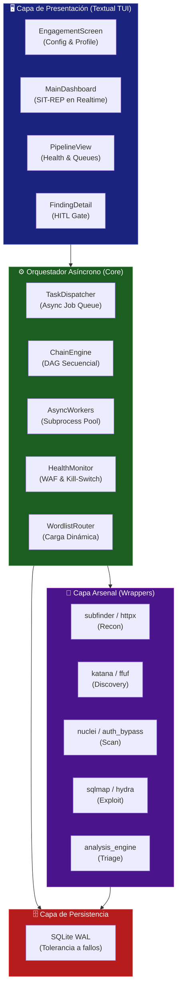
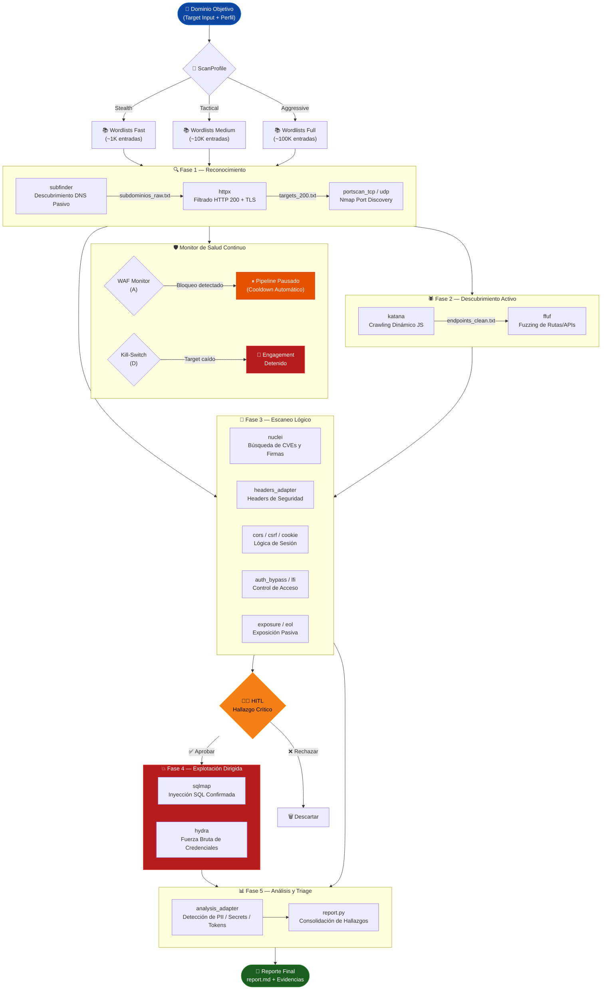
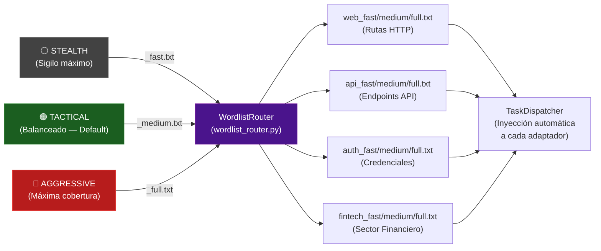

# ⚡ Striker: Modular TUI Pentest Orchestrator & Automation Framework

Striker es un orquestador de pentesting asíncrono y modular de alto rendimiento, diseñado específicamente para operar en auditorías de caja negra (Black-Box) sobre entornos corporativos de alta seguridad y misiones Red Team. En contraste con herramientas monolíticas o escáneres estáticos, Striker impone un pipeline asincrónico que automatiza la fase de inteligencia y reconocimiento ("grunt work"), gobernado bajo el estricto paradigma **HITL (Human-in-the-Loop)**.

El objetivo central es dotar al operador de un plano de control terminal reactivo (TUI) que unifique herramientas open-source fragmentadas, brindando evasión de Web Application Firewalls (WAF) en capa 7, control de concurrencia y persistencia de estado ante interrupciones de red.

## 🏗 Arquitectura y Topología (L3)

Descarté modelos basados en lenguajes bloqueantes e interfaces gráficas pesadas para priorizar el OPSEC y la compatibilidad en instancias remotas (VPS) mediante túneles SSH. La arquitectura se basa en **Python 3.10+** (AsyncIO), empleando concurrencia asincrónica de subprocesos y una interfaz de usuario terminal (TUI) provista por el framework `Textual`.

### Diagrama de Diseño Lógico (Pipeline Core)



### Decisiones de Diseño y Persistencia Transaccional (L3)
- **Desacople TUI / Workers:** La UI corre en el main thread de asyncio, delegando la carga computacional o las largas esperas de red de herramientas como *nuclei* y *ffuf* a los *AsyncWorkers*. El estado se propaga a la UI usando mensajes reactivos.
- **Transaccionalidad Anti-Corrupción (SQLite WAL):** Durante misiones largas (días), una caída de SSH o un OOM Kill destruirían el estado en arquitecturas en memoria. Striker guarda todo (engagements, tareas activas, hallazgos parseados) en SQLite activando el modo Write-Ahead Logging (WAL) para operaciones no bloqueantes concurrentes. El escaneo puede pausarse y reanudarse asimétricamente.

## 🛡️ DevSecOps, Control OPSEC y Evasión (L2 / L3)

El valor empresarial de Striker reside en su madurez para no interrumpir los negocios del cliente objetivo, garantizando OPSEC (Seguridad de las Operaciones) y una pisada en red adaptativa.

### Modulador Dinámico: Sistema de Perfiles de Auditoría
El "WordlistRouter" y el "TaskDispatcher" se alinean en torno a tres doctrinas seleccionadas al crear un engagement:
- ⚪ **Stealth:** Configuración paramétrica sigilosa. Dictados hiper-reducidos (`_fast.txt`, ~1K líneas), demoras intencionales (jitter) e hilos reducidos. Previene disparar alertas EDR o WAF L7.
- 🟢 **Tactical (Default):** Equilibrio costo-beneficio para ventanas de tiempo corporativas cortas. Diccionarios de ~10K líneas (`_medium.txt`).
- 🔴 **Aggressive:** Exclusivo para arquitecturas "White-Box" pre-aprobadas, volcando el total del payload computacional (`_full.txt`, ~100K líneas) para cobertura absoluta.

### Heurística de Salud: WAF Monitor y Kill-Switch
* **WAF Monitor (Evasión Reactiva):** Un daemon en background evalúa la telemetría de red. Si detecta anomalías estadísticas en los códigos HTTP (ej. pico abrupto de 403 Forbidden, 429 Too Many Requests, o bloqueos Cloudflare/Akamai), **pausa el pipeline completo**, ejecutando un "cooldown" automático de enfriamiento para purgar las tablas de bloqueo del firewall objetivo, tras lo cual reanuda operaciones.
* **Kill-Switch (Prevención DoS):** Si el ecosistema del cliente entra en estado crítico de denegación de servicio fortuita (cascada de errores 500/503 o timeouts absolutos), el orquestador ejerce un Hard Stop (Abort) sobre todas las tareas ofensivas, blindando el engagement.

## 🧑‍💻 Orquestación de Vulnerabilidades y Protocolo HITL (L2)

### Fases Estrictas del Pipeline (DAG)
Striker procesa los objetivos pasando por filtros decrecientes. La salida de un adaptador es la semilla limpia para el siguiente nodo en el grafo:
1. **Reconocimiento Pasivo:** Subfinder -> httpx -> nmap (Descubre topología).
2. **Descubrimiento Activo (Spidering):** Katana (JavaScript Crawl) -> FFUF (Fuzzing).
3. **Escaneo de Superficie:** Nuclei, Headers, CORS, CSRF, Exposure. Todo output pasa por Regex para estructurarlo en la DB WAL.

### Human-In-The-Loop (HITL) Gate
Para impedir la disrupción destructiva, implementé la fase de **Explotación Dirigida**.
- Una inyección de SQL ciega o un volcado masivo de credenciales jamás se ejecutará automáticamente. 
- Striker recolecta la *sospecha* de explotación, la cataloga como `CRITICAL` y pausa el worker correspondiente.
- Se eleva la decisión al panel del TUI (`FindingDetail`), demandando la intervención manual del Operador Humano (HITL). Sólo tras autorizar explícitamente (`Approve`), Striker desencadenará el payload destructivo a través del adaptador `sqlmap` o `hydra`.

## ⚙️ Aprovisionamiento y Trazabilidad (L2)

El framework descarta la complejidad de Docker debido a la profunda integración a nivel socket/red requerida para herramientas como Nmap, y en su lugar opta por una instalación nativa resiliente.
Se ejecuta un Shell Orchestrator (`setup_vps.sh`) que instaura el entorno perfecto en un Ubuntu KVM:

*Extracto del Aprovisionamiento Shell (L2)*
```bash
# ... Fragmento setup_vps.sh ...
# 1. Configura Swap para evitar OOM kills de herramientas Golang
sudo fallocate -l 4G /swapfile
sudo mkswap /swapfile && sudo swapon /swapfile

# 2. Compiladores nativos y motores Golang
sudo apt-get install -y gcc libpcap-dev python3-pip golang-go nmap

# 3. Instalación nativa del Arsenal Hacker
go install -v github.com/projectdiscovery/subfinder/v2/cmd/subfinder@latest
go install -v github.com/projectdiscovery/nuclei/v3/cmd/nuclei@latest
# Configuración global via symlinks para consumo por los adaptadores Python de Striker...
```

La arquitectura final cierra el bucle enviando el output combinado al **Analysis Engine** (Triage Offline) que busca expresiones regulares de Personally Identifiable Information (PII) o Secretos filtrados, consolidando un archivo `report.md` prístino e inviolable para entregar al CISO del cliente.


# 📄 Original README.md

# ⚡ Striker: Modular TUI Pentest Orchestrator

<div align="center">
  <p><i>Orquestación Quirúrgica y Asíncrona de Auditorías de Seguridad de Alto Rendimiento</i></p>
  <hr />
</div>

[](https://github.com/iota-sigma-dev/striker)
[](https://www.python.org/)
[](https://sqlite.org/)
[](https://ubuntu.com/)

**Striker** es un orquestador de pentesting asíncrono y modular de alto rendimiento diseñado específicamente para operaciones en entornos corporativos de alta seguridad. Basado en una arquitectura tolerante a fallos con persistencia transaccional mediante SQLite WAL, proporciona una interfaz de usuario terminal (TUI) rica y reactiva para el control de pipelines ofensivos completos — desde el reconocimiento inicial hasta el análisis forense de evidencias — incluyendo selección de perfil de auditoría, evasión activa de WAF y kill-switch integrado.

---

## 🎯 Objetivos de la Plataforma

* **Consolidación de Herramientas:** Centralizar el "grunt work" de la fase de descubrimiento y escaneo ofensivo, permitiendo al operador concentrarse en la lógica de negocio y explotación compleja.
* **Garantía OPSEC (HITL):** Minimizar el ruido de red y prevenir ejecuciones accidentales mediante el control interactivo **Human-in-the-Loop (HITL)** para fases ofensivas de explotación.
* **Resiliencia de Procesos:** Arquitectura tolerante a caídas que permite suspender, reanudar o recuperar tareas activas sin perder el estado del engagement.
* **Perfiles de Auditoría Adaptativos:** Selección de perfil por engagement (`Stealth` / `Tactical` / `Aggressive`) que condiciona el tamaño de los diccionarios, la velocidad de concurrencia y los límites de alerta en toda la cadena de adaptadores.

---

## 🏗️ Arquitectura del Sistema

### Diagrama de Capas

```mermaid
graph TB
    subgraph TUI["🖥️  Capa de Presentación (Textual TUI)"]
        direction LR
        E1["EngagementScreen\n(New Engagement)"]
        E2["MainDashboard\n(SIT-REP en Tiempo Real)"]
        E3["PipelineView\n(Estado de Fases)"]
        E4["FindingDetail\n(HITL Approval)"]
    end

    subgraph CORE["⚙️  Capa de Orquestación (Core)"]
        direction LR
        D["TaskDispatcher\n(Perfil + Fases)"]
        CH["ChainEngine\n(Pipeline Secuencial)"]
        WK["AsyncWorkers\n(Pool de Concurrencia)"]
        HP["HealthMonitor\n(WAF + Kill-Switch)"]
        WR["WordlistRouter\n(fast / medium / full)"]
    end

    subgraph ADAPTERS["🔧  Capa de Adaptadores (Arsenal)"]
        direction LR
        A1["subfinder\n(Recon)"]
        A2["httpx\n(Probe)"]
        A3["katana\n(Crawl)"]
        A4["ffuf\n(Fuzz)"]
        A5["nuclei\n(Scan)"]
        A6["sqlmap\n(Exploit)"]
        A7["hydra\n(Brute)"]
        A8["Analysis Engine\n(Triage)"]
    end

    subgraph DB["🗄️  Capa de Persistencia (SQLite WAL)"]
        direction LR
        T1["engagements\n(id, target, profile)"]
        T2["tasks\n(tool, status, phase)"]
        T3["findings\n(severity, evidence)"]
    end

    TUI --> CORE
    CORE --> ADAPTERS
    CORE --> DB
    ADAPTERS --> DB

    style TUI fill:#1a237e,stroke:#3949ab,color:#fff
    style CORE fill:#1b5e20,stroke:#388e3c,color:#fff
    style ADAPTERS fill:#4a148c,stroke:#7b1fa2,color:#fff
    style DB fill:#b71c1c,stroke:#e53935,color:#fff
```



---

### Flujo de Datos del Pipeline Ofensivo



---

### Sistema de Perfiles y Wordlist Router



---

## 🛠️ Arsenal Integrado

Striker utiliza un sistema de **Adaptadores Modulares** que encapsulan herramientas líderes en la industria ofensiva, parseando sus salidas estructuradas en tiempo real:

| Fase | Herramienta | Propósito |
|---|---|---|
| Recon | `subfinder` | Descubrimiento DNS pasivo vía APIs de inteligencia externas |
| Recon | `httpx` | Filtrado de hosts activos HTTP/HTTPS (200 OK) |
| Recon | `portscan_tcp/udp` | Descubrimiento de puertos abiertos via Nmap |
| Discovery | `katana` | Crawling con análisis dinámico de JavaScript |
| Discovery | `ffuf` | Fuzzing de rutas y endpoints usando wordlists por perfil |
| Scan | `nuclei` | Barrido de CVEs, firmas y vulnerabilidades lógicas |
| Scan | `headers_adapter` | Análisis de cabeceras de seguridad (CSP, HSTS, X-Frame) |
| Scan | `cors / csrf / cookie` | Validación de controles de sesión y CORS misconfiguration |
| Scan | `auth_bypass / lfi` | Pruebas de control de acceso y path traversal |
| Scan | `exposure / eol` | Exposición de archivos sensibles y tecnologías EOL |
| Exploit | `sqlmap` | Explotación de inyección SQL bajo aprobación HITL |
| Exploit | `hydra` | Fuerza bruta de credenciales con límites adaptados al perfil |
| Analysis | `analysis_adapter` | Detección offline de PII, tokens, claves y secretos |

---

## 🔧 Perfiles de Auditoría

Cada engagement se inicializa con un perfil que condiciona el comportamiento de **toda** la cadena:

| Perfil | Wordlist Size | Rate Limit | Concurrencia | Uso Recomendado |
|---|---|---|---|---|
| ⚪ **Stealth** | `_fast.txt` (~1K) | Muy bajo | Mínima | Entornos con IDS activo o WAFs agresivos |
| 🟢 **Tactical** | `_medium.txt` (~10K) | Estándar | Balanceada | Auditorías estándar con ventana de tiempo acotada |
| 🔴 **Aggressive** | `_full.txt` (~100K) | Máximo | Total | Entornos controlados o con permiso explícito de carga |

El perfil seleccionado queda **persistido en la base de datos SQLite** del engagement y es recuperado automáticamente en reinicios o recargas.

---

## 🛡️ Mecanismos de Evasión y Resiliencia

### WAF Monitor (Escenario A)
Detecta firmas de bloqueo activo del WAF (HTTP 403/429 con patrones específicos, timeouts consistentes) y pausa automáticamente el pipeline, ejecutando un cooldown configurable antes de retomar.

### Kill-Switch (Escenario D)
Monitorea la disponibilidad del host objetivo (errores 5xx persistentes, timeouts de red) y detiene el engagement antes de causar una denegación de servicio no intencional.

Ambos mecanismos son configurables desde la **pantalla de nuevo engagement** con retroalimentación en tiempo real.

---

## 🚀 Guía de Despliegue Rápido

Para entornos limpios basados en **Ubuntu 22.04 LTS** (VPS o VM local Multipass):

```bash
git clone https://github.com/iota-sigma-dev/striker.git
cd striker
sudo bash .agents/workflows/scripts/setup_vps.sh
```

### ¿Qué realiza el aprovisionador?
1. **Swap:** Reserva 4GB de espacio de intercambio para estabilidad bajo concurrencia.
2. **Compiladores:** Librerías nativas de C, Python3-pip, Nmap y **Go 1.24.0**.
3. **Arsenal:** `subfinder`, `httpx`, `katana`, `nuclei`, `ffuf`, `sqlmap`, `hydra`, `trufflehog v3` y `jwt_tool`.
4. **Symlinks:** Configura accesos globales en `/usr/local/bin` para todas las herramientas.
5. **Firmas Nuclei:** Descarga inicial de plantillas actualizadas (`nuclei -update-templates`).
6. **Dependencias TUI:** `textual`, `aiosqlite`, `rich`, `psutil`, `aiofiles`.

---

## 💻 Uso de la Terminal (TUI)

```bash
cd /opt
python3 -m striker
```

### Funcionalidades del Dashboard
* **SIT-REP Interactivo:** Monitoreo en tiempo real del progreso del engagement y carga de workers concurrentes.
* **Selector de Perfil:** Elección de `Stealth` / `Tactical` / `Aggressive` al crear un engagement, con descripción contextual dinámica en pantalla.
* **Control HITL:** Stack de vulnerabilidades pendientes de aprobación con decisión interactiva de 1-click.
* **Triage de Evidencias:** Acceso rápido a los hallazgos aislados de Nuclei y volcados de Sqlmap.
* **WAF & Kill-Switch Toggles:** Control en tiempo real de los mecanismos de evasión directamente desde la UI.

---

## 🔒 OPSEC y Modelo de Amenaza

* **Base de Datos Local:** Striker almacena todos sus estados y hallazgos en `~/.striker/striker.db` (SQLite WAL). Ningún dato transaccional es transmitido hacia la nube.
* **Rate Limits por Perfil:** Los límites de velocidad son inyectados automáticamente desde el `WordlistRouter` a cada adaptador, sin intervención manual.
* **Modo Air-Gapped:** La fase de análisis y detección de secretos opera completamente offline mediante regex del `analysis_adapter`.
* **HITL Estricto:** La fase de explotación (`sqlmap`, `hydra`) nunca se ejecuta sin aprobación explícita del operador.

---

## 🗺️ Roadmap de Desarrollo

* [x] **v1.0** — Núcleo TUI reactivo + Pipeline de Reconocimiento.
* [x] **v1.1** — Arsenal Lógico, Fuzzing Dirigido y Explotación con Aprobación HITL.
* [x] **v1.2** — WAF Monitor, Kill-Switch y Sistema de Salud Continuo.
* [x] **v1.3** — WordlistRouter, Perfiles `Stealth / Tactical / Aggressive` y Persistencia por Engagement.
* [x] **v1.4** — Selector de Perfil en TUI, descripción contextual dinámica y suite de tests de integración.
* [ ] **v1.5** — Motor Automatizado de Generación de Reportes Ejecutivos (PDF/HTML).
* [ ] **v2.0** — Clúster Distribuido de Agentes mediante SSH Seguro.

---
