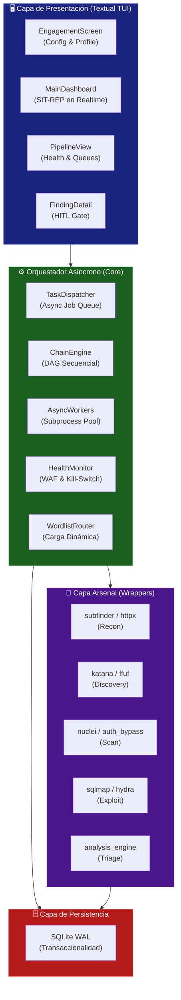
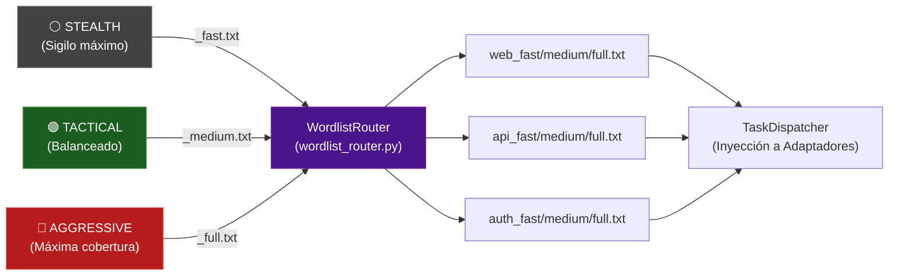
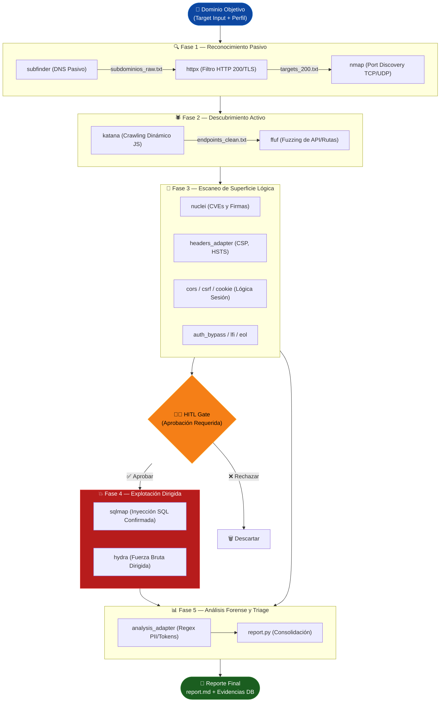

# ⚡ Striker: Modular TUI Pentest Orchestrator & Automation Framework

<div align="center">
  <p><i>Orquestación Quirúrgica y Asíncrona de Auditorías de Seguridad de Alto Rendimiento</i></p>
  <hr />
</div>

[](https://github.com/iota-sigma-dev/striker)
[](https://www.python.org/)
[](https://sqlite.org/)
[](https://ubuntu.com/)

**Striker** es un orquestador de pentesting asíncrono y modular de alto rendimiento, diseñado específicamente para operar en auditorías de caja negra (*Black-Box*) sobre entornos corporativos de alta seguridad y misiones Red Team. En contraste con herramientas monolíticas o escáneres estáticos, Striker impone un pipeline asincrónico que automatiza la fase de inteligencia y reconocimiento ("grunt work"), gobernado bajo el estricto paradigma **HITL (Human-in-the-Loop)**.

El objetivo central es dotar al operador de un plano de control terminal reactivo (TUI) que unifique herramientas open-source fragmentadas, brindando evasión activa de Web Application Firewalls (WAF) en capa 7, control de concurrencia y persistencia de estado ante interrupciones de red.

## 🎯 Objetivos Estratégicos de la Plataforma

* **Consolidación Quirúrgica:** Centralizar el trabajo exhaustivo de descubrimiento y escaneo, permitiendo al operador concentrarse en la lógica de negocio y explotación compleja de vulnerabilidades de día cero.
* **Garantía OPSEC (HITL):** Minimizar el ruido de red y prevenir disrupciones accidentales mediante el control interactivo y delegación de la fase destructiva exclusivamente bajo autorización humana explícita.
* **Resiliencia Computacional:** Arquitectura tolerante a caídas (OOM Kills, SSH disconnects) que permite suspender, reanudar o recuperar tareas activas sin perder el estado transaccional del *engagement*.

---

## 🏗 Arquitectura y Topología del Ecosistema (L3)

Descarté modelos basados en lenguajes bloqueantes e interfaces gráficas pesadas (GUI/X11) para priorizar el OPSEC y la compatibilidad universal en instancias remotas efímeras (VPS). La arquitectura se fundamenta en **Python 3.10+ (AsyncIO)**, empleando un *Subprocess Pool* para concurrencia masiva y una Interfaz de Usuario Terminal (TUI) provista por el framework `Textual`.

### Diagrama de Diseño Lógico (Pipeline Core)



### Decisiones de Diseño y Persistencia Transaccional
- **Desacople TUI / Workers:** La UI corre estrictamente en el *main thread* de AsyncIO. Las cargas computacionales pesadas y latencias de red de herramientas ofensivas (ej. `nuclei`, `ffuf`) se delegan a los *AsyncWorkers*. El estado se propaga mediante mensajería reactiva a la UI.
- **Transaccionalidad Anti-Corrupción (SQLite WAL):** En operaciones de varios días, una caída de la conexión SSH o un reinicio destruirían un pipeline almacenado en memoria. Striker persiste todo el ciclo de vida (engagements, payloads, hallazgos parseados) en SQLite activando el modo *Write-Ahead Logging (WAL)*. Esto garantiza escrituras concurrentes no bloqueantes y recuperabilidad absoluta (*resume* asimétrico).

---

## 🛡️ DevSecOps, Control OPSEC y Evasión Activa (L2 / L3)

El valor empresarial de Striker reside en su madurez para no interrumpir las operaciones de la infraestructura objetivo.

### Heurística de Salud Continua
1. **WAF Monitor (Evasión Reactiva - Escenario A):** Un daemon en background evalúa la telemetría. Si detecta anomalías estadísticas en respuestas HTTP (picos de `403 Forbidden`, `429 Too Many Requests`, o huellas de Cloudflare/Akamai), **pausa el pipeline completo**. Ejecuta un "cooldown" automático para purgar las tablas de baneo del firewall objetivo antes de reanudar operaciones.
2. **Kill-Switch (Prevención DoS - Escenario D):** Monitorea la disponibilidad del host objetivo. Ante fallos críticos (errores `500/502/503` persistentes o timeouts), el orquestador aplica un *Hard Stop* abortando todas las tareas para evitar una denegación de servicio no intencional.

### Modulador Dinámico: Sistema de Perfiles de Auditoría
El "WordlistRouter" inyecta límites paramétricos en tiempo real a cada adaptador según el perfil del Engagement:

| Perfil | Tamaño Dict. | Rate Limit | Concurrencia | Casos de Uso Recomendados |
|---|---|---|---|---|
| ⚪ **Stealth** | `_fast.txt` (~1K) | Muy bajo | Mínima | Entornos con IDS/IPS activo o WAFs agresivos L7. |
| 🟢 **Tactical** | `_medium.txt` (~10K)| Estándar | Balanceada | Auditorías estándar (Default) con ventana de tiempo acotada. |
| 🔴 **Aggressive** | `_full.txt` (~100K)| Máximo | Total | Ambientes pre-aprobados ("White-Box") buscando cobertura absoluta. |



---

## 🧑‍💻 Orquestación de Vulnerabilidades y Fases del DAG (L2)

Striker procesa los objetivos pasando por filtros decrecientes. El estándar de salida (STDOUT) de un adaptador es la semilla limpia para el siguiente nodo en el *Grafo Acíclico Dirigido (DAG)*.

### Flujo de Datos del Pipeline Ofensivo



### Protocolo Human-In-The-Loop (HITL)
Para impedir disrupciones destructivas, la Fase 4 de **Explotación Dirigida** está congelada por diseño.
- Una inyección de SQL ciega o volcado de credenciales jamás se ejecutará automáticamente.
- Striker recolecta la *sospecha* de explotación (ej. mediante `nuclei` info tags), la cataloga como `CRITICAL` y pausa el worker.
- Se eleva un *Prompt* visual al panel del TUI (`FindingDetail`), demandando la intervención manual del Operador Humano. Sólo tras un click explícito en `Approve`, el orquestador libera el *payload* destructivo al adaptador correspondiente (`sqlmap` o `hydra`).

---

## 🛠️ Arsenal Integrado (Wrappers C/Go)

Striker consolida herramientas líderes de la industria bajo un motor único de parseo estructural:

| Fase | Herramienta Integrada | Propósito Ofensivo |
|---|---|---|
| Recon | `subfinder` | Extracción de dominios ocultos consultando APIs de OSINT y fuentes pasivas. |
| Recon | `httpx` | Verificación de supervivencia de host, análisis de TLS y fingerprinting inicial. |
| Recon | `nmap` | Auditoría de puertos perimetrales y enumeración de servicios (TCP/UDP). |
| Discovery | `katana` | Headless crawling profundo simulando navegadores para extraer rutas embebidas en JS/SPA. |
| Discovery | `ffuf` | Fuzzing agresivo e iteración de directorios ocultos usando el enrutamiento del `WordlistRouter`. |
| Scan | `nuclei` | Escaneo veloz de CVEs expuestos, misconfigurations globales y *Tech Debt*. |
| Scan | Módulos Internos | Validación programática de Headers L7, fugas de CORS, CSRF, Exposure y LFI. |
| Exploit | `sqlmap` | Automatización forense de volcado de bases de datos mediante Inyección SQL (*Blind/Time-based*). |
| Exploit | `hydra` | Ruptura de bóvedas de autenticación mediante diccionarios tácticos adaptados al límite de fallos. |
| Analysis | `analysis_engine` | Detección *offline air-gapped* de PII, JSON Web Tokens, claves AWS y contraseñas filtradas en los resultados. |

---

## ⚙️ Aprovisionamiento de Entorno y Trazabilidad (L2)

Debido a que Striker exige vinculación profunda al Kernel para manipulación de sockets raw (como lo requiere Nmap) y maximiza la velocidad de ejecución nativa, el proyecto descarta las abstracciones de Docker a favor de un despliegue provisionado directamente a nivel sistema.

### Automatización Shell: `setup_vps.sh`
Para preparar un nodo táctico Ubuntu 22.04 LTS (KVM o Multipass), desarrollé el **Shell Orchestrator** que instaura un entorno prístino:

*Extracto del Aprovisionamiento Autonomo (L2)*
```bash
# 1. Fortificación de Memoria: Configura Swap para eludir OOM kills de escáneres Go-lang
sudo fallocate -l 4G /swapfile
sudo mkswap /swapfile && sudo swapon /swapfile

# 2. Inyección de Compiladores y Binarios Nativos
sudo apt-get update && sudo apt-get install -y gcc libpcap-dev python3-pip golang-go nmap

# 3. Instalación de Arsenal desde repositorios Core (Upstream)
go install -v github.com/projectdiscovery/subfinder/v2/cmd/subfinder@latest
go install -v github.com/projectdiscovery/nuclei/v3/cmd/nuclei@latest

# 4. Creación de Symlinks globales hacia /usr/local/bin garantizando acceso al Path
# 5. Bootstrap de firmas: Descarga y actualización de CVE templates
nuclei -update-templates
```

La arquitectura cierra el bucle enviando el output de toda la auditoría al **Analysis Engine**. Dicho motor recorre en modo *offline* todos los volcados buscando fugas (PII, Secretos), generando un archivo Markdown de hallazgos para entrega inmediata al CISO corporativo.

---

## 💻 Uso de la Terminal TUI (Operativa Diaria)

```bash
cd /opt/striker
python3 -m striker
```

* **SIT-REP Interactivo:** Matriz de monitoreo para carga de workers, memory footprint y logs de error en tiempo real.
* **Control WAF & Kill-Switch Toggles:** Switches asíncronos que permiten al operador forzar la interrupción o ignorar la heurística de salud sin detener la sesión general.

---

## 🗺️ Roadmap Técnico

- [x] **v1.0** — Núcleo Textual TUI reactivo y Pipeline secuencial de Reconocimiento.
- [x] **v1.1** — Integración de Arsenal Lógico, Fuzzing Dirigido y Módulo de Explotación (*HITL Approval*).
- [x] **v1.2** — Heurísticas defensivas: WAF Monitor, Kill-Switch y Sistema de Salud Continuo.
- [x] **v1.3** — `WordlistRouter` dinámico con Perfiles *Stealth / Tactical / Aggressive* y Persistencia WAL.
- [x] **v1.4** — Interfaz de Selector de Perfil contextual en el DAG, y validación mediante suite de Unit Tests en AsyncIO.
- [ ] **v1.5** — Motor Autónomo de Generación de Reportes Ejecutivos (PDF/HTML con métricas ejecutivas).
- [ ] **v2.0** — Despliegue en Enjambre: Clúster Distribuido de Agentes mediante SSH Seguro para escaneos multi-nodo.
